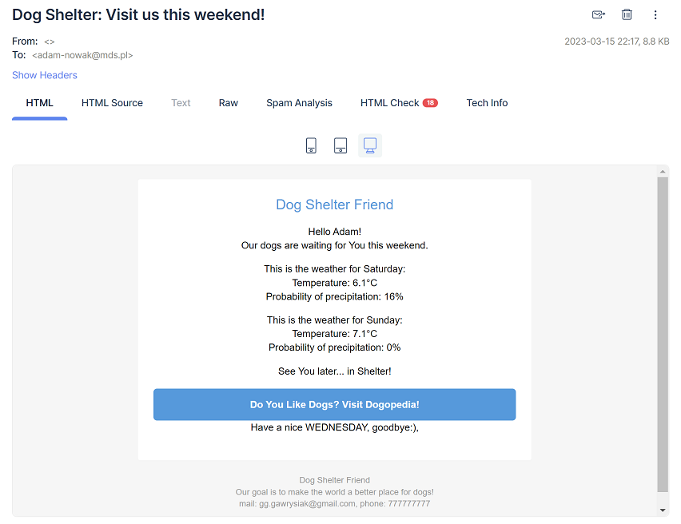
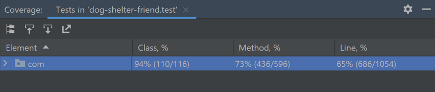
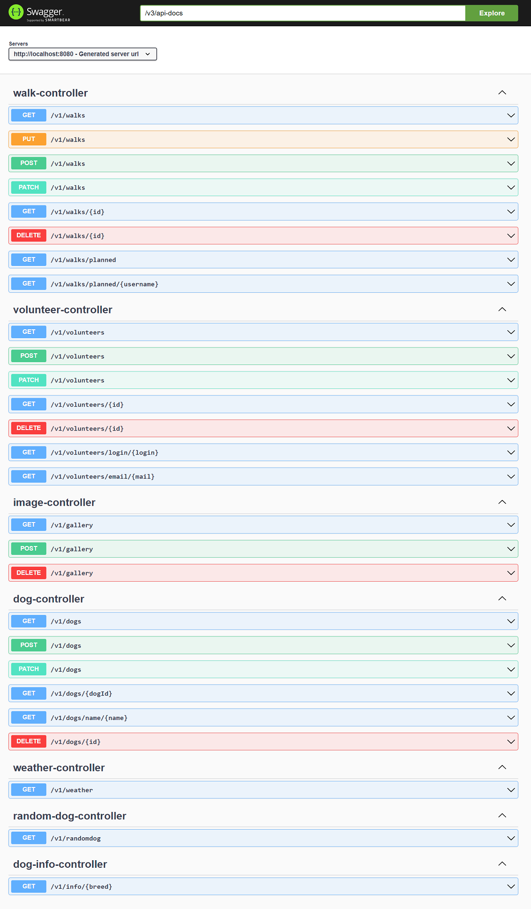

## Dog Shelter Friend - frontend

Prezentacja filmowa:

## Opis projektu:

Program zarządza danymi w bazie danych schroniska dla psów, przetrzymuje dane na temat wolontariuszy, psów i zaplanowanych przez wolontariuszy spacerów z psami. Posiada funkcję cyklicznego wysyłania maili do danych wolontariuszy i administratora.  
Każdy wolontariusz ma możliwość założenia konta, przeglądania zdjęć w galerii oraz wybrania psa którym zajmie się podczas spaceru. Użytkownik, po wybraniu pupila którym się zajmie i kliknięciu 'Walk the dog' rejestruje w systemie swoją chęć wyprowadzenia psa w wybranym dniu. Otrzyma także powiadomienie e-mail wysłane na maila podanego przy rejestracji w serwisie.
Admin ma dostęp do większej liczby funkcjonalności, np upload zdjęć, przeglądanie listy psów i wolontariuszy, zmiana roli dla wolontariuszy, oraz edycji wszystkich danych. Admin może dodać lub usunąć każdego psa lub wolontariusza, oraz anulować zaplanowane wyprowadzenie w przypadku niedostępności psa.

## Uruchomienie aplikacji:

- Stworzyć bazę danych MySQL o nazwie dogshelter
- utworzyć użytkownika bazy danych o nazwie: friend , z hasłem: password , oraz nadać mu uprawnienia do operacji na bazie danych.
- plik application.properties zawiera niezbędne klucze i ustawienia do serwisu cloudinary i mailtrap.io by w pełni zaprezentować wszystkie funkcjonalności aplikacji.

Najpierw należy uruchomić backend dostępny tutaj: https://github.com/gawrysiakg/dog-shelter-friend , uruchamiając metodę 'main' w klasie DogShelterApplication.java
Nastpnie należy uruchomić frontend aplikacji(Vaadin) znajdujący się w tym repozytorium
a w przeglądarce należy przejść po adres: http://localhost:8081
Przy starcie aplikacji tworzone są dwa testowe konta użytkowników, można zalogować się tymi danymi i sprawdzić wszystkie funkcjonalności:
- username: ADMIN , password: ADMIN
- username: USER , password: USER

Można też utworzyć nowego użytkownika, wystarczy wybrać Sign Up w okienku logowania.

### Technologie

- Java 11
- Gradle
- Spring Boot 2.7
- Hibernate
- REST API
- MySQL
- JUnit5
- Mockito
- Vaadin (frontend)
- Lombok
- external Cloudinary API
- JavaMailSender
- Thymeleaf
- Swagger
- Scheduler

### Cechy aplikacji

- Zewnętrzne API:
  - Cloudinary - upload zdjęć z dysku użytkownika, umieszczenie w serwisie Cloudinary, zapis adresów url do bazy danych, oraz wyświetlenie galerii zdjęć na stronie schroniska.
  - Prognoza pogody - wyświetlanie aktualnej pogody na stronie głównej, wysyłanie maili zachęcających do spaceru z pupilem, informujących też o pogodzie na najbliższe dni.
  - Dog info - pobieranie z zewnętrznego serwisu najważniejszych informacji o wybranej rasie psa
- Email scheduler - codzienne automatyczne powiadomienie email o ilości zaplanowanych spacerów z psami
- Email Scheduler z pogodą na weekend - w każdy piątek wysyła maila do wszystkich wolontariuszy w bazie
- Swagger pod adresem http://localhost:8080/swagger-ui/index.html
- Pokrycie testami - ponad 70% metod
- Wzorce projektowe:
  - Fasada
  - Builder
  - Singleton

### Scheduler z pogodą na weekend:

### Test Coverage:

### Lista endpointów:

## Autor
Grzegorz Gawrysiak

https://www.linkedin.com/in/gawrysiak

## Vaadin project structure:

- `MainLayout.java` in `src/main/java` contains the navigation setup (i.e., the
  side/top bar and the main menu). This setup uses
  [App Layout](https://vaadin.com/docs/components/app-layout).
- `views` package in `src/main/java` contains the server-side Java views of your application.
- `views` folder in `frontend/` contains the client-side JavaScript views of your application.
- `themes` folder in `frontend/` contains the custom CSS styles.
